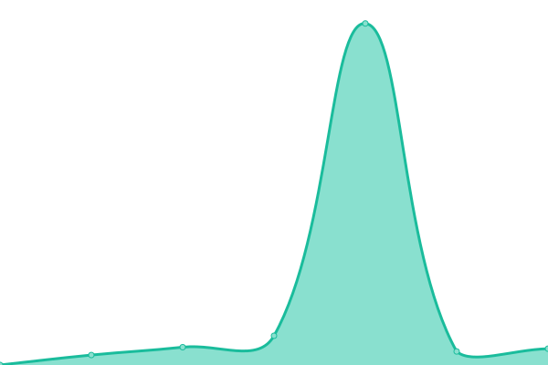
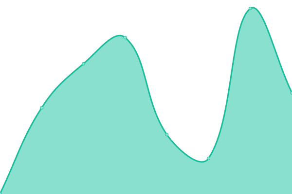
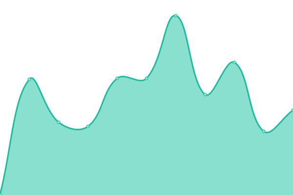
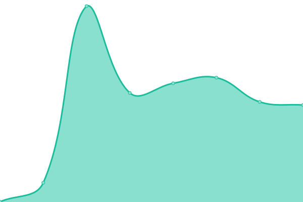
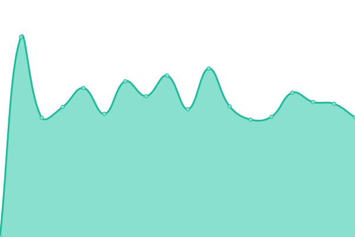
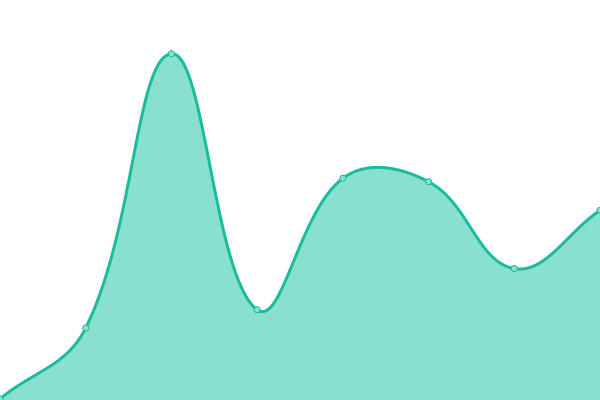
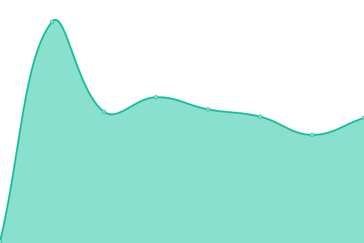
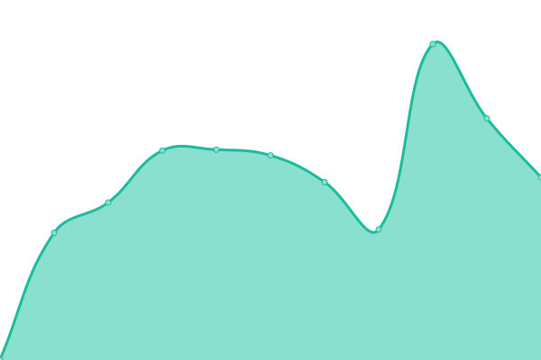

# [📈 Live Status](https://status2.gioco.lol): <!--live status--> **🟧 Partial outage**

This repository contains the open-source uptime monitor and status page for [Giocoliere](https://giocoliere.dev), powered by [Upptime](https://github.com/upptime/upptime).

With [Upptime](https://upptime.js.org), you can get your own unlimited and free uptime monitor and status page, powered entirely by a GitHub repository. We use [Issues](https://github.com/giocoliere/upptime/issues) as incident reports, [Actions](https://github.com/giocoliere/upptime/actions) as uptime monitors, and [Pages](https://status.gioco.lol) for the status page.

<!--start: status pages-->
<!-- This summary is generated by Upptime (https://github.com/upptime/upptime) -->
<!-- Do not edit this manually, your changes will be overwritten -->
<!-- prettier-ignore -->
| URL | Status | History | Response Time | Uptime |
| --- | ------ | ------- | ------------- | ------ |
|  [Wesbsite v0.7](https://www.giocoliere.dev) | 🟩 Up | [wesbsite-v0-7.yml](https://github.com/giocoliere/upptime/commits/HEAD/history/wesbsite-v0-7.yml) | 

 367ms
     
 | 

<a href="https://status.gioco.lol/history/wesbsite-v0-7">99.78%</a>
    

|  [Wesbsite v0.1](https://gioco.is-a.dev) | 🟩 Up | [wesbsite-v0-1.yml](https://github.com/giocoliere/upptime/commits/HEAD/history/wesbsite-v0-1.yml) | 

 214ms
     
 | 

<a href="https://status.gioco.lol/history/wesbsite-v0-1">100.00%</a>
    

|  [Giocoliere | Links](https://links.gioco.lol) | 🟩 Up | [giocoliere-links.yml](https://github.com/giocoliere/upptime/commits/HEAD/history/giocoliere-links.yml) | 

 368ms
     
 | 

<a href="https://status.gioco.lol/history/giocoliere-links">98.86%</a>
    

|  [Giocoliere - Test Statuspage](https://test.gioco.lol) | 🟥 Down | [giocoliere-test-statuspage.yml](https://github.com/giocoliere/upptime/commits/HEAD/history/giocoliere-test-statuspage.yml) | 

 847ms
     
 | 

<a href="https://status.gioco.lol/history/giocoliere-test-statuspage">97.59%</a>
    

|  [Humanaelitterae](https://humanaelitterae.com) | 🟩 Up | [humanaelitterae.yml](https://github.com/giocoliere/upptime/commits/HEAD/history/humanaelitterae.yml) | 

 262ms
     
 | 

<a href="https://status.gioco.lol/history/humanaelitterae">100.00%</a>
    

|  [Modmail](https://modmail.creeperhub.net) | 🟩 Up | [modmail.yml](https://github.com/giocoliere/upptime/commits/HEAD/history/modmail.yml) | 

 299ms
     
 | 

<a href="https://status.gioco.lol/history/modmail">100.00%</a>
    

|  [CreeperHUB](https://creeperhub.net) | 🟩 Up | [creeper-hub.yml](https://github.com/giocoliere/upptime/commits/HEAD/history/creeper-hub.yml) | 

 276ms
     
 | 

<a href="https://status.gioco.lol/history/creeper-hub">100.00%</a>
    

|  [creepers.sbs](https://creepers.sbs) | 🟩 Up | [creepers-sbs.yml](https://github.com/giocoliere/upptime/commits/HEAD/history/creepers-sbs.yml) | 

 866ms
     
 | 

<a href="https://status.gioco.lol/history/creepers-sbs">100.00%</a>
    

|  [Creepercraft](https://creepercraft.net) | 🟩 Up | [creepercraft.yml](https://github.com/giocoliere/upptime/commits/HEAD/history/creepercraft.yml) | 

 201ms
     
 | 

<a href="https://status.gioco.lol/history/creepercraft">100.00%</a>
    

|  [Otakuforge](https://creeperhub.net/otakuforge) | 🟩 Up | [otakuforge.yml](https://github.com/giocoliere/upptime/commits/HEAD/history/otakuforge.yml) | 

 67ms
     
 | 

<a href="https://status.gioco.lol/history/otakuforge">92.95%</a>
    

|  [CreeperLAB](https://creeperlab.org) | 🟩 Up | [creeper-lab.yml](https://github.com/giocoliere/upptime/commits/HEAD/history/creeper-lab.yml) | 

 347ms
     
 | 

<a href="https://status.gioco.lol/history/creeper-lab">100.00%</a>
    

<!--end: status pages-->

[**Visit our status website →**](https://status.gioco.lol)

## 📄 License

- Powered by: [Upptime](https://github.com/upptime/upptime)
- Code: [MIT](./LICENSE) © [Anand Chowdhary](https://anandchowdhary.com), supported by [Pabio](https://pabio.com)
- Data in the `./history` directory: [Open Database License](https://opendatacommons.org/licenses/odbl/1-0/)
